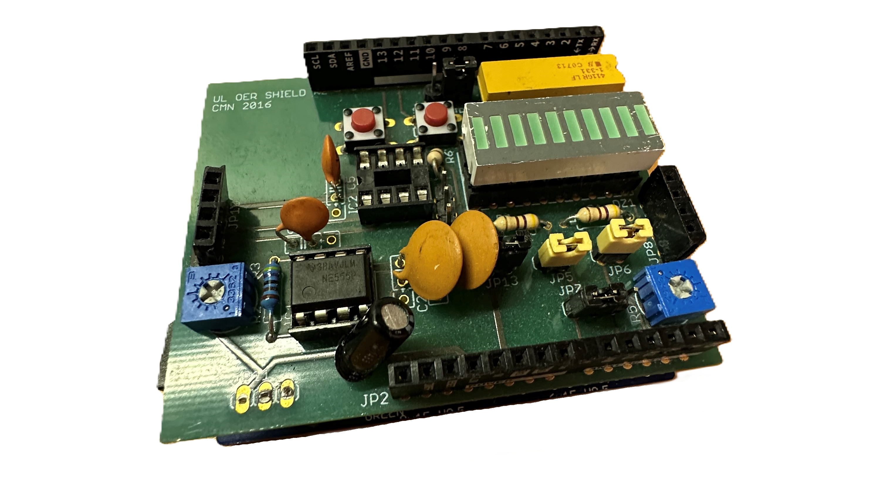

# Projects in Embedded Software
## Hardware
For these projects, an Arduino Every with an ATmega4809 microcontroller was used. The microcontroller was mounted on a custom adapter board to allow compatibility with Arduino UNO R3 Shields. A custom board was attached to the adapter, which included 10 LEDs, 1 potentiometer, 2 buttons, and 1 variable frequency generator.

## Project 1
**Cylon animation with voltage reading**

The board is programmed to do the following
- Show a cylon animation (See [appendix 1](https://ww1.microchip.com/downloads/en/DeviceDoc/ATmega4808-4809-Data-Sheet-DS40002173A.pdf)).
- When a button on the board is held, show voltage reading from potentiometer.
- Every 16 seconds, show a split view, voltage on the right, and cylon on the left.
- If voltage reading <= 3V, set cylon animation speed to 0.125S.
- If voltage reading > 3V, set cylon animation speed to 0.5S.

All time based functionality was implemented using interrupts.

## Appendix
### Appendix 1: Cylon
A cylon is a sequential activation of the LED:s.
1. Turn on LED 1
2. Turn off LED 1, and turn on LED 2.
3. Turn off LED 2, and turn on LED 3.
4. Repeat until you reach the end.
5. Reverse procedure

### Appendix 2: ATmega 4809
For more information, see [datasheet](https://ww1.microchip.com/downloads/en/DeviceDoc/ATmega4808-4809-Data-Sheet-DS40002173A.pdf).

### Appendix 3: Adapter board
